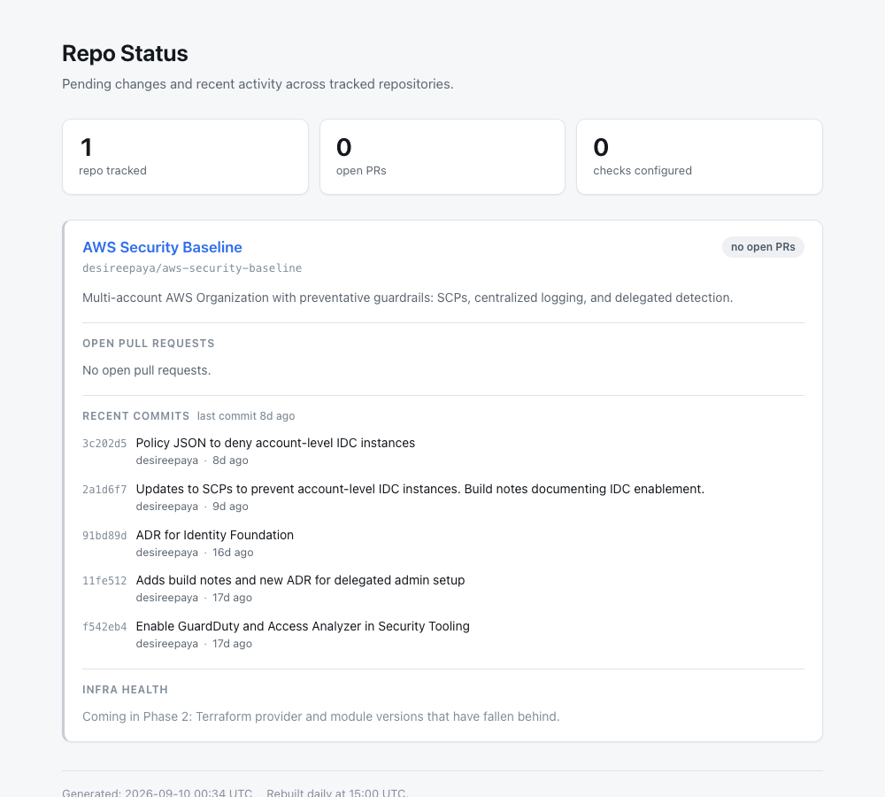
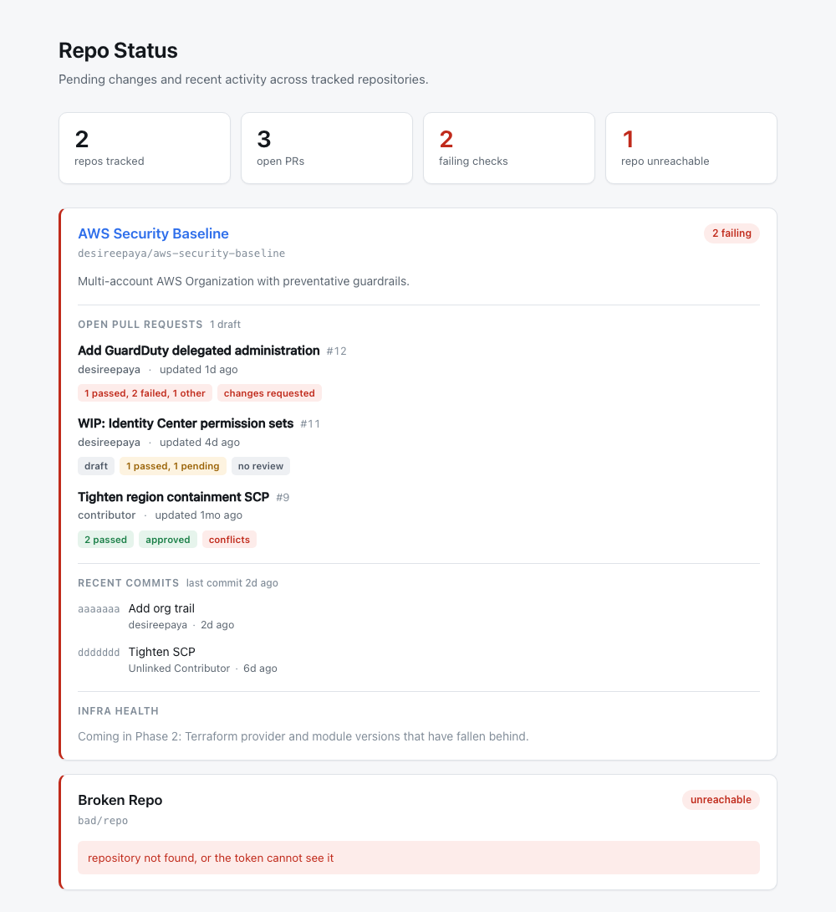

> [!NOTE]
> **Status**: Phase 1 build complete

# Repo Status Dashboard

A dashboard that shows what work is pending, and what has recently changed, across my GitHub repositories. It rebuilds itself every day and publishes to a public web page.

**Live**: https://desireepaya.github.io/repo-status-dashboard/

**Built with**: Python, GitHub REST API, Jinja2, GitHub Actions, GitHub Pages

## What it shows

For each repository being tracked:

- Open pull requests, with author, age, and whether the PR is still a draft
- Whether the automated tests on each pull request passed, failed, or are still running
- Review status: approved, changes requested, or waiting on a reviewer
- A warning if a pull request has merge conflicts
- The five most recent commits on the main branch, and how long ago the last one landed

At the top of the page, a summary strip shows totals: repositories tracked, open pull requests, and test failures.



The page above is the real one, generated from live data. Since I work alone and commit straight to the main branch, there are usually no open pull requests to show, so here is the same page with pull requests present:



*The second image uses test fixtures rather than real pull requests, so that the review and test features can be seen. The live link always shows the real current state.*

## Why I built it

GitHub shows you what is pending inside one repository. It does not give you a single view across all of them. That gap does not matter much with one repository, but it grows with every repository added. This dashboard was built early so it is already in place when the repository count makes it useful.

## How it works

```
config/repos.yaml  ->  GitHub API  ->  HTML page  ->  published to GitHub Pages
```

1. A config file lists which repositories to track.
2. A Python script calls the GitHub API and collects pull request, test and commit data.
3. Jinja2 templates turn that data into a single HTML page.
4. A scheduled GitHub Actions job runs the whole pipeline daily at 15:00 UTC and publishes the result.

Adding a repository to the dashboard is a config change. No code edits are needed:

```yaml
repos:
  - slug: owner/name
    display_name: Human Readable Name
```

## Running it locally

```bash
uv sync
GH_TOKEN=$(gh auth token) uv run repo-status generate --config config/repos.yaml --out dist/
```

Add `--serve` to open a local preview in the browser.

## Design decisions

**Used the GitHub API directly instead of a client library.** It keeps the project down to three dependencies, and it makes the data easy to fake during development. That second point mattered: the repository being tracked usually has zero open pull requests, so the "page full of pull requests" view cannot be tested against live data.

**Used the temporary token GitHub Actions provides, rather than creating a permanent access token.** Public repository data can be read with any valid token, so the one Actions generates for each run is enough. A permanent token would have been worse: it lives longer, has to be stored as a secret, and needs manual rotation. The token Actions creates expires as soon as the job finishes.

This changes if I ever track a private repository. The automatic token cannot read private repositories other than its own, so that would require a scoped, read only token with an expiry date. The code does not need to change for this, since it reads whichever token is provided.

**Built the review status from the raw review list.** The API endpoint being used does not return a single "approved / not approved" answer, so the script works it out: changes requested takes priority, then approval, then whether anyone has been asked to review. It is labelled as a review status rather than a merge decision, because it is a reconstruction rather than GitHub's own verdict.

**Left the published page public and unauthenticated.** Everything shown is already public information from public repositories. If a private repository is ever added, this decision has to be revisited alongside the token, because the page would then be publishing private information to an open URL.

**One repository that fails to load does not break the page.** It renders as an "unreachable" card with the reason, and the rest of the dashboard still builds.

**Recent commits are listed, but not counted.** Open pull requests measure work that is waiting for review, which assumes a review workflow exists. Working alone and committing straight to the main branch, that number is almost always zero, so the dashboard had very little to show. Listing the last five commits fixes that, because it says what is actually being worked on.

A count of commits over the last month was considered and rejected. One substantial commit and twenty small fixes produce very different numbers and close to the opposite meaning, so the figure invites a comparison it cannot support. On a page a recruiter might scan, a low number reads as inactive when it may mean careful. A single "last commit" timestamp answers the same question without implying a score.

**The test results tile says what was actually observed, not just a count of zero.** "0 failing tests" sounds reassuring, but it is the same number whether every test passed or no tests exist at all. A dashboard that cannot tell those apart is worse than no dashboard, because it reports good news it has not verified. So the tile distinguishes four cases: tests ran and some failed, tests ran and all passed, tests are set up but have not reported yet, and no tests are set up at all. Deciding which applies needs one extra API call per repository to ask whether any workflows exist. If that call fails, the dashboard falls back to the weaker wording rather than claiming something it could not confirm.

## Planned next

**Phase 2: infrastructure health.** Terraform records the exact versions of the providers and modules it uses in a lock file. The next phase reads that file, compares it against the current published versions, and flags anything that has fallen behind. Each repository card already has a placeholder for this section.

## Deliberately left out

**Drift detection.** Checking whether live infrastructure still matches what the code describes requires running Terraform against real AWS credentials. That needs its own access role and trust policy, which is a security task in its own right. It belongs in a separate phase rather than being folded into a reporting tool.

**Security scanning.** GitHub already surfaces vulnerable dependencies and code scanning alerts, with a workflow attached for fixing them. Repeating those findings on a second page produces a dashboard nobody acts on.

**Uncommitted local work.** A scheduled job running on GitHub's servers has no visibility into my laptop. Reporting on it would mean either installing something locally or showing data that is out of date.

**Commit counts.** Two versions of this were considered. Counting commits since the last release was cut because I do not tag releases yet, so it would have shown an empty result every time. Counting commits over the last month was cut as a vanity metric, for the reasons in the design decisions above. What replaced both is the list of recent commits, which shows the work itself rather than a number standing in for it.

## Known limitation

Test results are read from GitHub's Checks API. A repository that reports results the older way, through commit statuses, will show "no checks" on its pull requests. Everything currently tracked uses GitHub Actions, which reports check runs.

## Repository layout

```
config/repos.yaml              which repositories to track
src/repo_status/
  cli.py                       command line entrypoint
  config.py                    reads and validates the config file
  models.py                    the data shapes used by the page
  collectors/github.py         calls the GitHub API
  render.py                    turns data into HTML
templates/                     page templates
static/style.css               single stylesheet, no framework
.github/workflows/             scheduled build and publish
```

## Setup note

GitHub Pages has to be enabled once, with the source set to GitHub Actions. This can be done from the command line, so the whole setup stays scriptable:

```bash
gh api -X POST repos/OWNER/REPO/pages -f build_type=workflow
```

It only needs doing a single time. Until it is done, the publishing step of the workflow will fail with a "Get Pages site failed" error, even though the build step succeeds.
